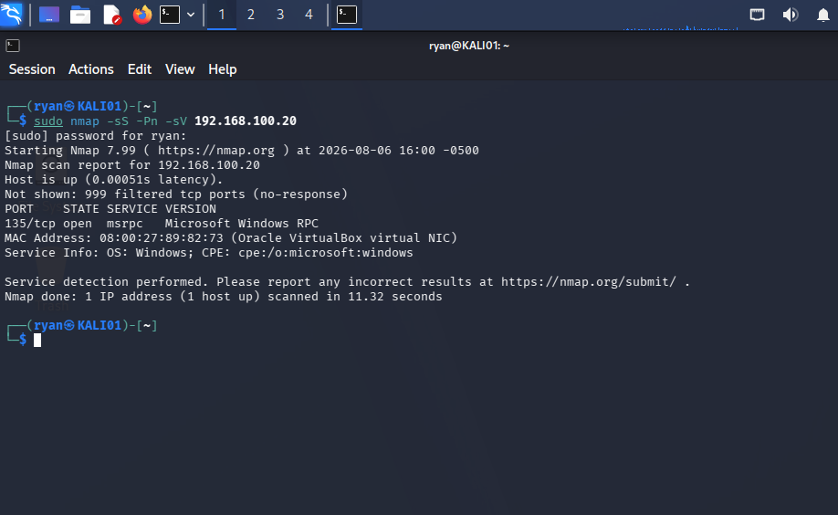
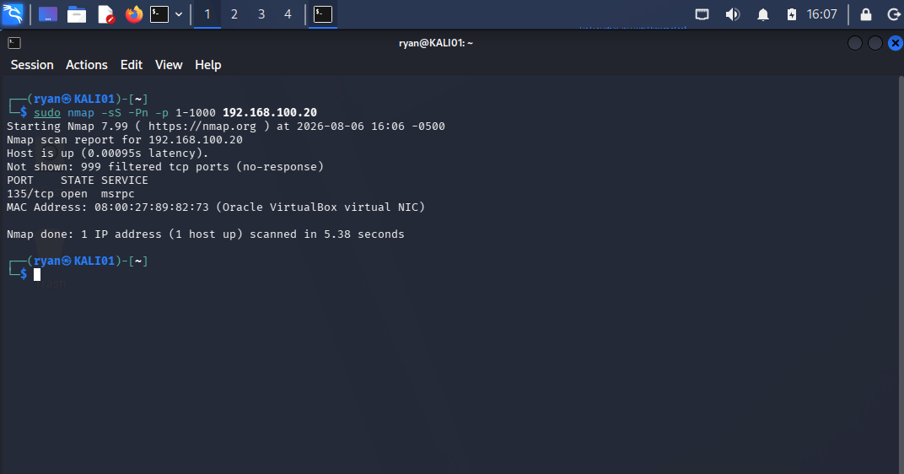
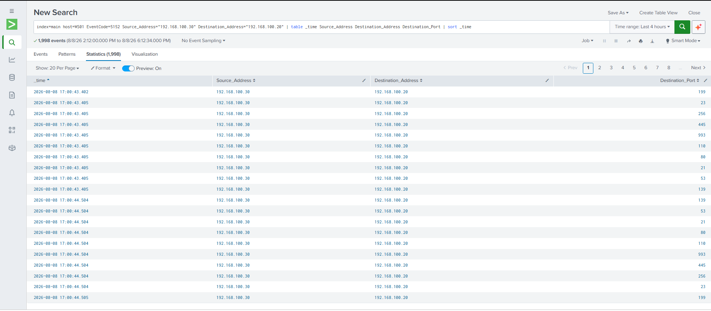
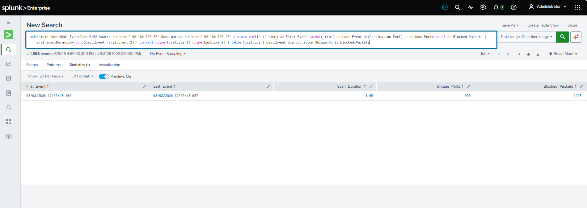
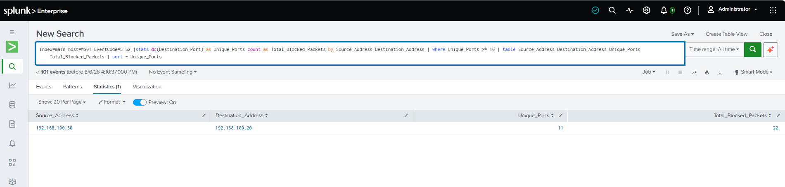
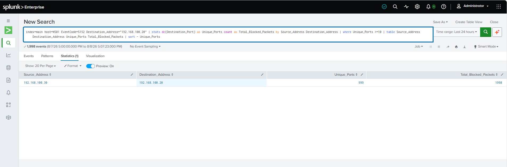
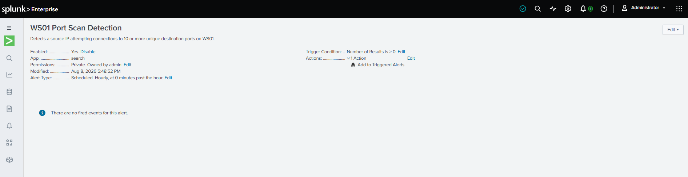
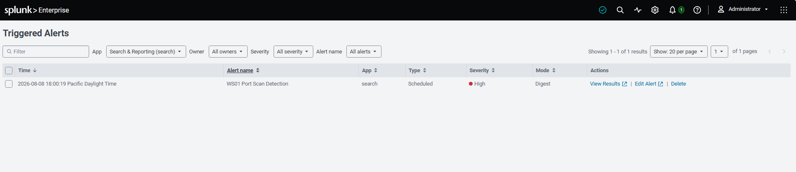

# Network Reconnaissance / Port Scan Detection

## Overview

This project demonstrates the detection and investigation of network reconnaissance activity within an Active Directory and Splunk homelab.

Using Kali Linux, I simulated an Nmap port scan against a monitored Windows workstation (WS01). Windows Filtering Platform telemetry was forwarded to Splunk, where I investigated the resulting network activity and developed an SPL detection to identify sources targeting a high number of unique destination ports.

The completed detection was configured as a scheduled high-severity Splunk alert and validated using controlled Nmap activity.

## Lab Environment

| System | IP Address | Role |
|---|---|---|
| KALI01 | 192.168.100.30 | Attack / Security Testing System |
| WS01 | 192.168.100.20 | Monitored Windows Workstation |
| DC01 | 192.168.100.10 | Domain Controller / Splunk Enterprise Server |

**Key Technologies:** Kali Linux, Nmap, Windows 10 Pro, Windows Filtering Platform, Splunk Enterprise, Splunk Universal Forwarder, SPL

## Attack Simulation

Network reconnaissance was simulated from KALI01 against the monitored Windows workstation WS01.

Using Nmap, I performed a TCP port scan targeting ports 1–1000 on WS01 (`192.168.100.20`). The scan generated network traffic across a large number of destination ports, providing controlled reconnaissance activity for detection and investigation in Splunk.

**Attack System:** KALI01 (`192.168.100.30`)  
**Target System:** WS01 (`192.168.100.20`)  
**Tool:** Nmap

### Nmap Service Scan

The initial reconnaissance scan identified exposed services on WS01 and confirmed that the target was reachable from KALI01.



### Port Scan — Ports 1–1000

A broader TCP scan targeting ports 1–1000 was then performed against WS01 to generate the reconnaissance activity used for detection development.



## Splunk Investigation

Following the Nmap scan, I investigated the resulting network activity in Splunk using Windows Security telemetry collected from WS01.

Windows Filtering Platform Event ID 5152 records packets blocked by the Windows Filtering Platform. Analysis of these events showed repeated inbound connection attempts originating from KALI01 (`192.168.100.30`) and targeting WS01 (`192.168.100.20`) across a large number of destination ports.

Key fields used during the investigation included:

- `Source_Address`
- `Destination_Address`
- `Destination_Port`
- `EventCode`
- `_time`

By analyzing these fields in Splunk, I was able to correlate the Windows telemetry with the Nmap activity and identify the behavior associated with a rapid multi-port network scan.

### Windows Filtering Platform Event

Inspection of Windows Filtering Platform Event ID 5152 confirmed that WS01 was blocking inbound packets originating from KALI01 (`192.168.100.30`). The event telemetry exposed the source address, destination address, destination port, and network direction used during the investigation.


### Port Scan Event Timeline

Reviewing the events by timestamp and destination port showed a rapid sequence of connection attempts from KALI01 to WS01 across many different ports.



### Scan Duration Analysis

Further analysis summarized the reconnaissance activity and showed **999 unique destination ports** and **1,998 blocked packets** occurring within approximately **4.65 seconds**.



## Detection Development

After identifying the port scan behavior in the Windows Filtering Platform telemetry, I developed an SPL detection to identify sources attempting connections across a high number of unique destination ports.

The detection aggregates Event ID 5152 activity by source and destination address, counts the number of unique destination ports targeted, and identifies activity where a source reaches a threshold of **10 or more unique destination ports**.

### SPL Detection

The following SPL search was developed to detect sources targeting 10 or more unique destination ports:

```spl
index=main host=WS01 EventCode=5152
| stats dc(Destination_Port) as Unique_Ports count as Total_Blocked_Packets by Source_Address Destination_Address
| where Unique_Ports >= 10
| table Source_Address Destination_Address Unique_Ports Total_Blocked_Packets
| sort - Unique_Ports
```

### Detection Testing

Initial testing confirmed that the detection successfully identified KALI01 (`192.168.100.30`) targeting multiple unique destination ports on WS01 (`192.168.100.20`). The threshold of 10 unique destination ports was exceeded, producing a detection result at 11 unique ports.



### Detection Validation

The detection was then validated against a larger Nmap scan targeting ports 1–1000. Splunk identified traffic from KALI01 to WS01 across 999 unique destination ports and recorded 1,998 blocked packets.



### Scheduled Alert

After validating the detection logic, the search was configured as a scheduled Splunk alert named **WS01 Port Scan Detection**. The alert runs hourly and triggers when the detection search returns a result.



### Alert Validation

The Nmap activity was repeated to validate the completed alert workflow. The **WS01 Port Scan Detection** alert successfully triggered and was recorded in Splunk as a **High-severity** alert.



## Project Outcome

This project demonstrated the complete detection engineering workflow from attack simulation through alert validation.

By generating controlled Nmap reconnaissance from KALI01, I was able to investigate Windows Filtering Platform telemetry in Splunk, identify the fields associated with multi-port scanning, and develop an SPL detection based on the number of unique destination ports targeted.

The final detection successfully identified the simulated reconnaissance activity and was configured as a scheduled high-severity Splunk alert for continued monitoring.

### Skills Demonstrated

- Network reconnaissance analysis
- Windows Filtering Platform Event ID 5152 investigation
- Splunk log analysis
- SPL detection development
- Detection threshold tuning
- Source and destination IP correlation
- Security alert configuration
- Detection and alert validation

## Final Project Report

A detailed project report documenting the attack simulation, Splunk investigation, detection development, testing, and alert validation is available below.

[View Final Project Report](Network_Reconnaissance_Port_Scan_Detection_Project_Report.pdf)


